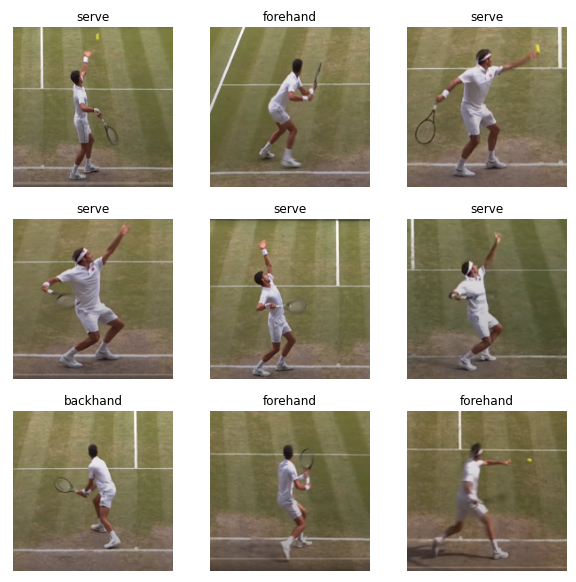
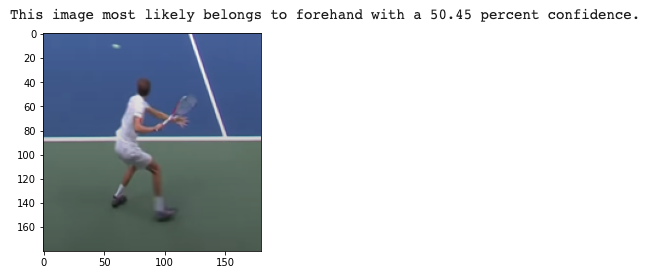

# Tennis Shot Prediction
Given input of a tennis player in a shot motion (forehand, backhand, serve, volley, etc.), this ML algorithm can classify it with high accuracy based on a curated Wimbledon dataset. See the examples below!

